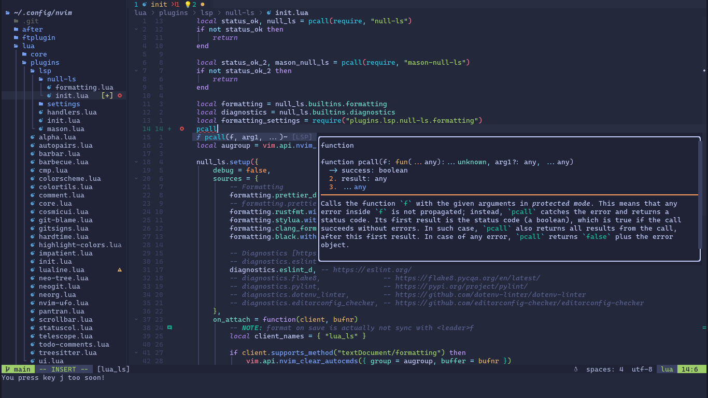

# Setup on Linux

To set up Neovim on Linux, follow these steps:

1. Clone the repository to your `~/.config/` directory using the following command:
```sh
git clone https://github.com/jgsn13/nvim ~/.config/
```
2. Proceed with further configurations and customizations as per your requirements.

Feel free to explore the repository and adapt the Neovim settings to suit your coding needs.

## Screenshot


## Useful guidelines

- Change contents within curly braces, including the braces themselves: `ci{`.
- Copy current line and the next 5 lines below it: `y5j`.
- Cut current paragraph and paste it elsewhere: `dap`.
- Delete contents inside double quotes, excluding the quotes themselves: `di"`.
- Select current paragraph visually: `vip`.
- Convert current line to lowercase: `guu`.
- Copy current word: `yiw`.
- Change contents within an HTML tag: `cit`.
- Copy from current line up to second occurrence of "foo" in the document: `y2/foo`.
- Cut current block of code and paste it elsewhere: `dap`.
- Delete current word, excluding surrounding whitespace: `diw`.
- Select current paragraph and join it with the next paragraph: `vipJ`.
- Prevent repeating keystrokes of `k`, `j`, `h`, `l` within a time frame.
- Optimize editing efficiency by substituting `c$` with `C`.
- Minimize use of arrow keys and the mouse.
- Perform vertical movement on the screen using relative jumps like `5k` or `12j`.
- Use shortcuts (`CTRL-U`, `CTRL-D`, `CTRL-B`, `CTRL-F`, `gg`, `G`) for vertical movement outside the visible screen.
- Enable short-distance horizontal movement with word-motion commands (`w`, `W`, `b`, `B`, `e`, `E`, `ge`, `gE`).
- Facilitate medium to long-distance horizontal movement with commands (`f`, `F`, `t`, `T`, `0`, `^`, `$`, `,`, `;`).
- Utilize operator commands with motion or text-objects (`ci{`, `y5j`, `dap`) whenever applicable.
- Use macros to record and playback keystrokes: `q<register>` to start/stop recording and `@<register>` to execute.
- Open command-line window with `q:` for executing Ex commands and editing them before execution.
- Navigate quickly with marks by setting (`ma`) and jumping (`'a`) to specific locations in the file.
- Leverage registers (`"ayiw`) to store and manipulate text snippets for later use (`"ap` for pasting).
